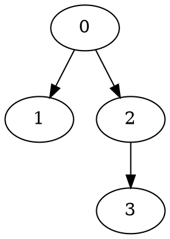

### Graphviz
Graphviz renders graphs/trees from a simple text file (.dot).
You print edges → Graphviz draws the picture.
```console
$ sudo apt install graphviz
$ dot -V
```


```console
$dot -Tpng tree.dot -o tree.png
$ xdg-open tree.png
```
```c
typedef struct Node{
    int key;
    struct Node **children;
    int children_count;
} Node;

void print_dot(Node *node, FILE *out) {
    if (node->children_count == 0) {
        fprintf(out, "    %d;\n", node->key);
        return;
    }
    for (int i = 0; i < node->children_count; i++) {
        fprintf(out, "    %d -> %d;\n",
                node->key,
                node->children[i]->key);
        print_dot(node->children[i], out);
    }
}
```
```c
FILE *dot = fopen("tree.dot", "w");
fprintf(dot, "digraph G {\n");
fprintf(dot, "    node [shape=circle];\n");
print_dot(root_node, dot);
fprintf(dot, "}\n");
fclose(dot);
```